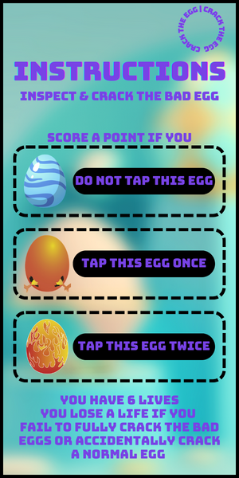
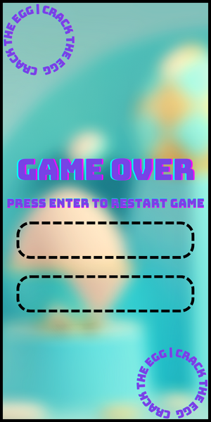

# Crack the Egg

## Overview

"Crack the Egg" is a fun and challenging game developed in p5.js where players take on the role of a worker in an egg factory. The goal is to inspect eggs on conveyor belts, cracking them based on their type. The game features three egg categories: "normal," "bad," and "very bad," each requiring different actions from the player.

## [Play "Crack The Egg"](https://editor.p5js.org/mt4610/sketches/XgShKTIyL)

## Table of Contents

- [Screenshots](#screenshots)
- [How to Play](#how-to-play)
- [Controls](#controls)
- [Scoring](#scoring)

## Screenshots

## How to Play

- **Start Menu:** Click on the "START" button to begin the game or choose "INSTRUCTIONS" to view how to play.
- **Gameplay:** Inspect eggs on three conveyor belts. Single tap to crack "bad" eggs and double-tap to crack "very bad" eggs. Avoid cracking "normal" eggs. As the game progresses, conveyor belt speeds increase.
- **Game Over:** The game ends when you run out of lives. Click "RESTART" to play again. Try to beat your high score!

## Controls

- Single Tap: Crack "bad" eggs.
- Double Tap: Crack "very bad" eggs.

## Scoring

- Gain points for each successfully inspected egg.
- Avoid losing lives by not cracking "normal" eggs.
- Every 50 points, the game becomes more challenging.
